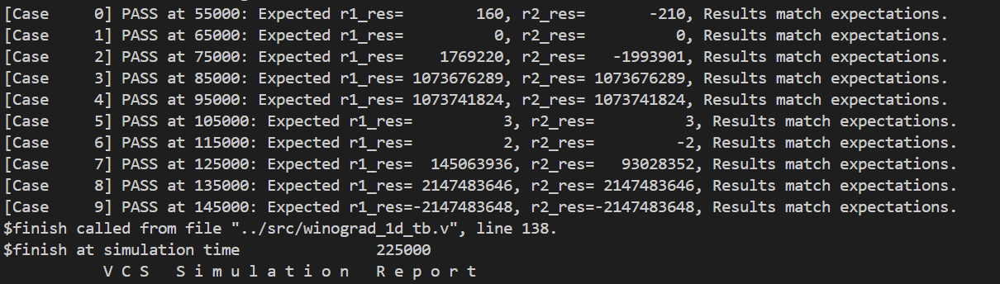
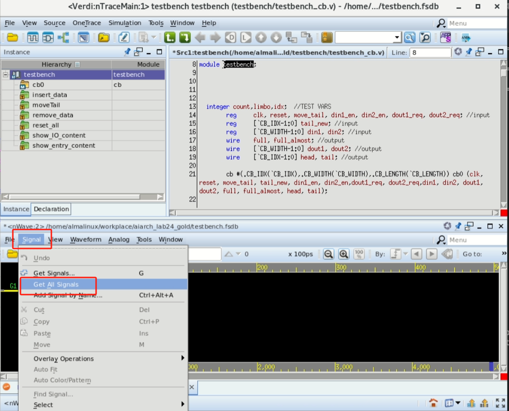
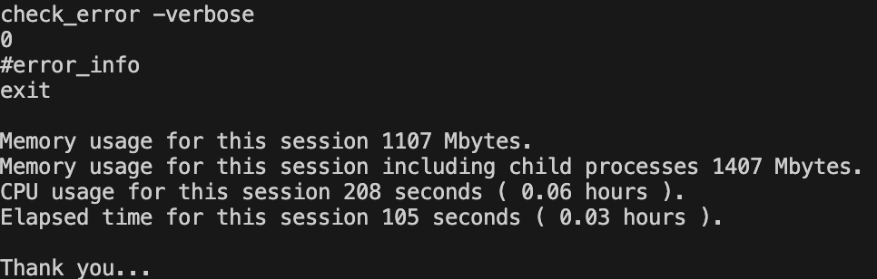

## Update

(点击跳转到对应位置)

- 2025-10-22: [优化任务3说明，增加流水线后运行 Testbench 的提示](#update-1022)
- 2025-11-01: 增加实验环境问题的[Troubleshooting](#troubleshooting)部分


## Troubleshooting

如果在实验中遇到 `vcs:Command not found`, `dc_shell:Command not found` 等类似错误（多发生在机房停电后），你可以尝试运行以下命令修复：

1. 尝试重启机器：

```bash
sudo reboot
```
2. 如果重启无效，尝试重新加载环境变量：

```bash
sudo systemctl start eda-*.service
source ~/.bashrc
```

如果仍然无法解决问题，请联系助教寻求帮助。

## 实验目的

1. 理解并实现1D Winograd卷积计算单元的设计。

2. 理解数字逻辑中流水线的基本概念及其在提升频率和吞吐量方面的作用。

3. 理解吞吐、设计复杂度、面积、延迟之间的权衡。

- <span style="color:darkred; font-weight:bold;">注意：本实验的重点是对上述内容的理解，而非最终的指标！为避免内卷，综合指标（面积、功耗、频率等）不会作为评分依据。请不要过分追求综合结果的好坏。</span>

- <span style="color:darkred; font-weight:bold;">注意：请不要修改综合脚本中除时钟周期 (CLK_PERIOD) 以外的任何参数，否则可能导致综合结果异常。</span>


## 背景知识

1. Winograd算法是一种用于加速卷积运算的高效算法，尤其在深度学习的卷积神经网络（CNN）中广泛应用。它通过减少乘法次数来优化计算，特别适合小尺寸卷积核。

2. Winograd算法的核心思想是**将卷积转化为多项式乘法**，利用一些数学变换，将 Input 和 Kernel 映射到另一个空间进行更高效的计算。

- **例如对于一维卷积**：对于输入 $$d = [d_0, d_1, d_2, d_3]$$ 和 Kernel $$g = [g_0, g_1, g_2]$$ ，输出为2个元素。
    
    - **原始计算方法**：需6次乘法与4次加法。

    - **Winograd算法**：通过变换将乘法次数降至4次（加法次数增加到8次），步骤如下：
        1. 将计算表示为： 
        
        $$F(2,3) = \begin{bmatrix}  d_0 & d_1 & d_2\\  d_1 & d_2 & d_3\end{bmatrix}\begin{bmatrix} g_0 \\ g_1 \\g_2\end{bmatrix}= \begin{bmatrix} m_1 + m_2 + m_3 \\ m_2 - m_3 - m_4\end{bmatrix}$$

        其中：

        $$m_1=(d_0-d_2)g_0$$

        $$m_2=(d_1+d_2)\frac{g_0+g_1+g_2}{2}\\$$

        $$m_3=(d_2-d_1)\frac{g_0-g_1+g_2}{2}\\$$
        
        $$m_4=(d_1-d_3)g_2$$
        
        - 将上面的计算过程写成矩阵的形式如下：$$Y = A^T[(Gg)\odot (B^Td)]$$，其中：

            - $$\odot$$ 表示 Hadamard product，即对应位置相乘操作；

            - $$g$$ 表示卷积核；$d$ 表示输入特征图（输入信号）；

            - $$G$$ 表示卷积核变换矩阵；

            - $$B^T$$ 表示输入变换矩阵；

            - $$A^T$$表示输出变换矩阵；
                        
            $$B^T=\begin{bmatrix}   1 & 0 & -1 & 0 \\   0 & 1 & 1 & 0 \\   0 & -1 & 1 & 0 \\   0 & 1 & 0 & -1\end{bmatrix} $$

            $$G=\begin{bmatrix}1 & 0 & 0 \\\frac{1}{2} & \frac{1}{2} & \frac{1}{2} \\\frac{1}{2} & -\frac{1}{2} & \frac{1}{2} \\0 & 0 & 1 \\\end{bmatrix} $$

            $$A^T = \begin{bmatrix}   1 & 1 & 1 & 0 \\   0 & 1 & -1 & -1 \\\end{bmatrix} $$

            $$g = \begin{bmatrix}g_0 & g_1 & g_2\end{bmatrix}^T $$

            $$d = \begin{bmatrix}d_0 & d_1 & d_2 & d_3\end{bmatrix}^T$$
            
- **二维扩展**：通过嵌套一维变换实现，如$$F(2\times2, 3\times3)$$，输入块为$$4\times4$$，输出为$$2\times2$$，乘法次数从36次降至16次。

## 准备实验所需的环境和文件
1. **环境准备**：本实验需要使用 CLab for EDA 环境，请参考 Lab0 进行环境搭建。

2. **文件准备**：在课程共享文件的 `/mnt/nfs/` 文档下，你能看到 `Lab1` 文件夹，该文件夹包含了本实验所需的所有文件。该目录是只读的，你需要将其复制到自己的家目录下进行实验，可以使用如下命令：

    ```bash
    cp -r /mnt/nfs/Lab1/ ~/Lab1
    cd ~/Lab1
    ```

    该目录中包括两个任务所需的文件夹，分别为 `winograd_comb` 和 `winograd_pipeline`，每个文件夹中都包含了实验所需的源代码、测试平台、Makefile等文件。


## 任务 1：基于组合逻辑的 1D Winograd 卷积计算单元 (60 pts)

**任务 1 中，你需要实现一个纯组合逻辑的，卷积核大小固定的 1D winograd 卷积计算单元。计算单元的部分代码已经提供，你需要填补空缺的代码。**

### 实验步骤

1. `winograd_comb` 文件夹包含了此任务需要的文件。文件结构如下：

    ```bash
    ├── run (进行仿真的目录)
    │   ├── Makefile
    │   └── winograd.f
    ├── dc (进行综合的目录)
    │   ├── Makefile
    │   ├── rpts (综合结果报告)
    │   └── ...
    └── src (Verilog 源代码目录)
        ├── input_transform.v (此处需要填空)
        ├── output_transform.v (此处需要填空)
        ├── weight_transform.v (此处需要填空)
        ├── winograd_1d_tb.v
        └── winograd_1d.v (此处需要填空)
    ```
    
    TOP module 位于 `winograd_1d.v` 中。
    
2. 补充各 `.v` 文件中的空缺，完成代码；

3. 在完成后，你需要运行 testbench 来验证模块的功能。Testbench 中编写了计算的 Golden Model，会自动比较你编写的模块输出与标准结果。
    
    **Testbench 运行方法**
    
    - **不显示波形**
        
        进入 `run` 目录，运行 `make rerun` 即可运行模拟，同时不会显示波形，由于该操作不依赖于GUI，可以在VS Code中直接使用。由于在testbench中设置了 `$monitor` 命令，会输出不同时刻的计算结果，可以用于验证结果是否正确。
        
        
        
    - **显示波形（使用verdi）**
        
        配合Verdi，可以显示电路运行过程中的波形，便于进行debug。进入 `run` 目录，运行 `make all` 即可进行模拟并显示波形。由于依赖GUI，**这一步骤需要使用远程桌面。**
        
        如运行成功，会自动弹出Verdi窗口，在Verdi窗口中，选择下方 `Signal - Get All Signals` 即可显示所有波形。
        
        
        
4. 清除运行产生的临时文件
    
    只要运行 `make clean` 即可清除所有运行产生的临时文件。
    

## 任务 2： 基于流水线的 1D Winograd 卷积计算单元 (30 pts)

虽然如任务1中所做的那样，1D winograd可以完全通过组合逻辑完成计算，但是这会导致较大的延迟，阻碍频率和吞吐的提升，因此在任务2中，我们需要引入流水线来解决这一问题。

### 实验步骤

1. **尝试综合纯组合逻辑的设计**：进入 `winograd_comb/dc` 目录，运行 `make dc` 进行综合。这里我们设置不同的时钟周期，进行两次综合。

    - **第一次综合**：直接综合，使用默认的 20ns 时钟周期。建议保存 `dc` 目录下的 `rpts` 目录，以便后续对比。

    - **第二次综合**：修改时钟周期为 4ns，重新运行 `make dc` 进行综合。具体操作是：

        - 在 `winograd_comb/dc/syn_tcl/syn.tcl` 文件中，将 `set CLK_PERIOD 20.0` 修改为 `set CLK_PERIOD 4.0`；

        - 保存文件后，重新运行 `make dc` 进行综合。

        - 同样建议保存 `rpts` 目录，以便对比。

    综合完成输出如下：

    

    综合完成后，你可以在 `rpts` 目录下查看综合报告。你可以在 `winograd_1d.area.rpt` 文件中查看面积情况。此处我们重点关注 `winograd_1d.timing.max.rpt` 文件，该文件中包含了时序约束的满足情况。你会发现，纯组合逻辑的设计无法满足 4ns 的时序约束。该文件的内容可能像是：

    ```
    Startpoint: r3_w[10] (input port clocked by clk)
    Endpoint: r1_res[31] (output port clocked by clk)
    Path Group: clk
    Path Type: max

        ...

    Point                        Fanout     Trans      Incr       Path      Attributes
    ------------------------------------------------------------------------------------------

        ... 

    ------------------------------------------------------------------------------------------
    data required time                                            3.50
    data arrival time                                            -4.83
    ------------------------------------------------------------------------------------------
    slack (VIOLATED)                                             -1.33
    ```

    这里的 `slack` 即为时序裕量，负值表示不满足时序约束。这里意味着，`r3_w[10]` 到 `r1_res[31]` 之间的路径延迟超过了 4ns 的时序约束，无法在 4ns 内完成计算。


2. **引入流水线**：进入 `winograd_pipeline` 目录，该目录下的文件结构与 `winograd_comb` 目录类似，区别在于 `src` 目录下的 `winograd_1d.v` 文件中你需要补充流水线的相关代码。这里你需要将任务1中完成的`input_transform.v`、`weight_transform.v`、`output_transform.v` 复制到 `winograd_pipeline/src/` 目录下，并在 `winograd_1d.v` 中实例化这些模块。具体如何完成可以参考 `winograd_1d.v` 文件中的提示。

3. **验证功能**：进入 `winograd_pipeline/run` 目录，运行 `make rerun` 或 `make all` 来验证功能，确保你的设计与任务1中的设计功能一致。


    <div style="border: 1px solid gray; padding: 10px; margin: 10px" id="update-1022" markdown="1">

    (10.22 Updated)

    <!-- <a id="update-1022"></a> -->

    此处需要注意的是，由于引入了流水线，输出结果会有一定的延迟。因此在输入数据后，需要等待足够的时钟周期，才能看到正确的输出结果。Testbench 你需要根据你设计的流水线延迟，修改 `winograd_1d_tb.v` 文件中的等待 tick 数量，确保能够正确捕获输出结果。代码示例如下：

    ```verilog
// Case 0
#15 en = 1;
r1_x = -32'sd10; r2_x = 32'sd20;
r3_x = -32'sd30; r4_x = 32'sd40;
r1_w = 32'sd2; r2_w = 32'sd3; r3_w = -32'sd4;
calc_expected_results(r1_x, r2_x, r3_x, r4_x, r1_w, r2_w, r3_w, expected_r1_res[0], expected_r2_res[0]);
#10 compare_results(0,expected_r1_res[0], expected_r2_res[0], r1_res, r2_res);
    ```

    `compare_results` 前的 `#10` 表示等待10个 tick，你需要根据你的流水线设计，调整这个等待时间，确保能够正确捕获输出结果。（默认的时钟周期是 10 ticks）
    </div>


4. **综合并验证时序**：进入 `winograd_pipeline/dc` 目录，运行 `make dc` 进行综合，综合完成后，你可以在 `rpts` 目录下查看综合报告，重点关注 `winograd_1d.timing.max.rpt` 文件，确保时序约束被满足。此时你应该会看到 `slack` 为正值，表示时序约束被满足。

    此外，你可以在 `winograd_1d.area.rpt` 文件中查看面积报告，在 `winograd_1d.power.rpt` 文件中查看功耗报告，了解不同设计的面积和功耗情况。

## 任务 3：基于流水线的 1D Winograd 卷积计算单元优化 (10 pts)

在任务2中，你已经成功实现了一个基于流水线的1D Winograd卷积计算单元，并且满足了时序约束。接下来，你可以尝试对设计进行优化，以进一步提升运行频率。

### 实验步骤
1. **通过时序报告了解瓶颈**：通过查看 `winograd_pipeline/dc/rpts/winograd_1d.timing.max.rpt` 文件，可以看到slack最小的路径（该文件是按照slack升序排列的）。你可以通过查看这些路径，了解设计中的瓶颈所在。此外，你也可以尝试将时钟周期进一步缩短（例如2ns），重新进行综合，查看此时是否发生了时序违例。

    这里预期瓶颈主要出现在大位宽的乘法器上。

2. **优化设计**：你可以尝试使用流水线乘法器，将大位宽的乘法器替换为分拆为位宽较小的流水线乘法器。这样可以减少单个乘法器的延迟，从而提升整体设计的频率。

3. **验证功能和时序**：在进行优化后，重复任务2中的步骤3，确保优化后的设计功能正确且满足时序约束。

4. **比较优化前后的性能**：使用 2ns 甚至更短的时钟周期，重新进行综合，并比较优化前后的时序报告，查看slack的变化，了解优化带来的提升。同时，你也可以比较面积和功耗的变化，了解优化的代价。

## 实验报告

请将你的实验过程和结果整理成实验报告，内容包括：

1. 任务1的实现过程和结果截图；

2. 对任务2中纯组合逻辑设计的综合结果分析（包括时序报告截图和分析）；

3. 任务2中流水线设计的实现过程和结果截图；

4. 对比分析任务2中纯组合逻辑设计 (20ns) 和流水线设计 (4ns) 的综合结果（包括时序、面积、功耗等方面的对比）；

5. 任务3的优化过程和结果截图，以及优化前后的对比分析。

## 提交方式

需要提交实验报告，请提交 PDF 格式，命名为 `Lab1_Report_学号_姓名.pdf`。

提交时请附上源代码 **（只需要 src 文件夹中的`.v`代码文件，如果你最终得到了一个很大的压缩包，这说明你多打包了无用的临时文件！）**。

将实验报告和源代码打包成压缩包，压缩包命名同实验报告，并将其上传至北大课程网。